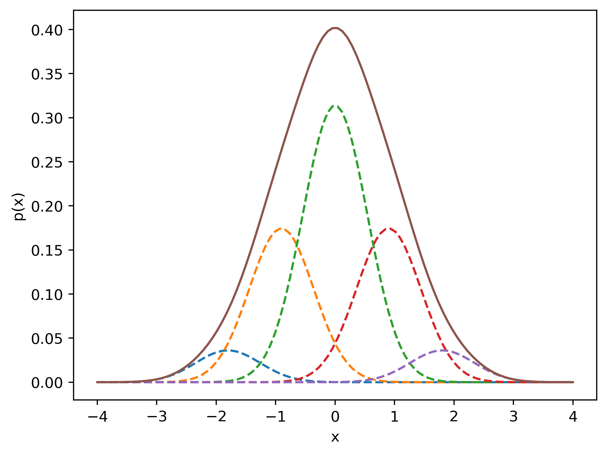

Examples
========

This section provides examples of using PyEst for various applications.

Splitting the Univariate Standard Normal Distribuion
---------------------------------------------------------------------
The PyEst library makes it easy to split a univariate standard normal distribution
in an optimal way, which is fundamental to the formation of so-called
"splitting libraries."

Each splitting solution is determined by the number of mixands :math:`L` and the
regularization parameter :math:`\lambda`, which controls how large the resulting
mixand variances are.

The first time PyEst generates an optimal split solution for an
:math:`(L,\lambda)` pair that hasn't been used before, it will solve an
optimization problem and cache the resulting solution to disk. All future calls
with this parameter pair will simply reference the cached result and thus be much
faster.

.. literalinclude:: ../examples/example_simple_gaussian_split.py
   :language: python

Splitting and Plotting PyEst Gaussian Mixtures
---------------------------------------------------------------------

This example demonstrates using PyEst to split a mixand in a Gaussian mixture, and how to plot the resulting Gaussian mixture:

.. literalinclude:: ../examples/example_gm_2d_split.py
   :language: python

Gaussian Mixture Splitting for Field-of-View and Negative Information
---------------------------------------------------------------------

This example demonstrates recursive splitting for fields-of-view for incorporating negative information:

.. literalinclude:: ../examples/example_split_for_fov.py
   :language: python

Cartesian to Polar Transformation
------------------------------

This example demonstrates the transformation of a Gaussian mixture from Cartesian to polar coordinates:

.. literalinclude:: ../examples/example_splitting_polar_transformation.py
   :language: python

Cislunar Space Object Uncertainty Propagation
---------------------------------------------

This example shows how to use pyest for propagating uncertainty in the circular restricted three-body problem
(CR3BP).

.. note::
    This example utilizes a cache of precomputed Monte Carlo samples to evaluate various performance measures.
    If the cache is not available, this example will generate new samples and store them in a cache for future use.
    On first run, this may take a few minutes to build the cache. These samples are only for performance evaluation
    and not required for any of the adaptive Gaussian splitting operations.

.. literalinclude:: ../examples/example_splitting_cislunar.py
   :language: python
